# Assembly Simulation

A 50-vs-50 battle simulation written by hand in x86-64 assembly, built
up from "never written assembly" one stage at a time.

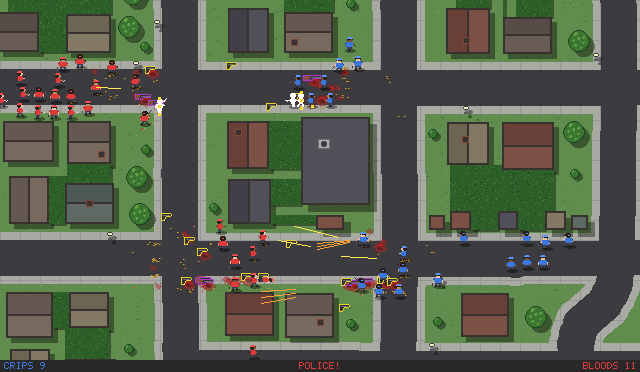

*Stage 9.03, about 5 seconds of a fight on the south side map, with
the camera zoomed in 2×. The Bloods (red) hold the corner while the
Crips (blue) push up the street. Yellow lines are pistol tracers,
orange fans are shotgun blasts, and the blood and brass stay where
they fall. See [Progression](#progression) for how it got here.*

The idea comes from Chris Sawyer, who wrote about 99% of RollerCoaster
Tycoon (1999) in hand-written assembly with a thin layer of C for
Windows. This project works in the same spirit, at a smaller scale.
Everything is NASM: the AI, combat, pathing, line of sight, line
drawing, the random number generator, even turning numbers into text.
SDL2 is called directly from assembly for the window, input and blitting
pixels. The latest build imports 16 SDL2 functions and four from libc
(the startup routine, plus `getenv`, `atoi` and `strtoull` to read its
settings), and nothing else.

## Highlights

- **Two teams of 50** fight with knives, pistols and shotguns until one
  side is wiped out. Everyone starts with a knife. Guns spawn as
  pickups, get fought over, and drop back onto the map when their owner
  dies.
- **Cover and line of sight:** a wall with a gap in the middle. Ranged
  weapons need a clear line, checked with the same Bresenham walk that
  draws lines on screen.
- **Collision, random mirrored spawns, friendly fire and hold fire:**
  soldiers can't overlap. Shots hit whoever is actually in the way, so
  soldiers side-step for a clear shot rather than fire through a
  teammate.
- **Hand-rolled RNG:** xorshift64, seeded from the CPU's cycle counter
  (`rdtsc`) through splitmix64, verified bit for bit against a Python
  reference in gdb.
- **Tested for fairness, not just "it runs":** a headless batch harness
  plays dozens of games at once and counts wins. It has caught several
  real biases that were invisible in any single game, including one
  exactly one pixel wide. See [Verification](#verification).

## Progression

The same project at each stage, from the first hand-plotted pixels to
a city's south side. Every image is a real frame from that stage's
program, read back from the renderer in gdb.

| | |
|:---:|:---:|
| 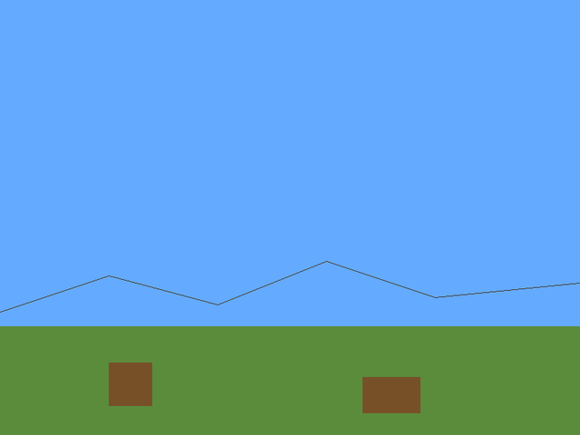 | 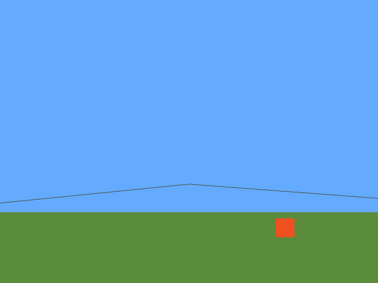 |
| **Stage 3.** The first picture: a pixel buffer, `fill_rect`, and Bresenham lines for the hills, all computed by hand | **Stage 4.** Animation: a bouncing square, double buffered |
| 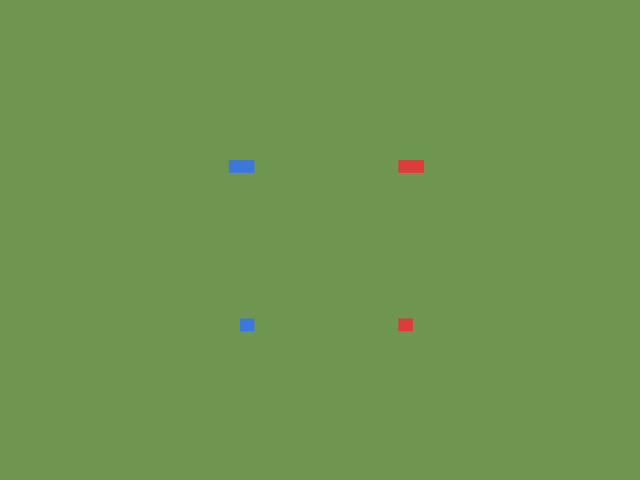 | 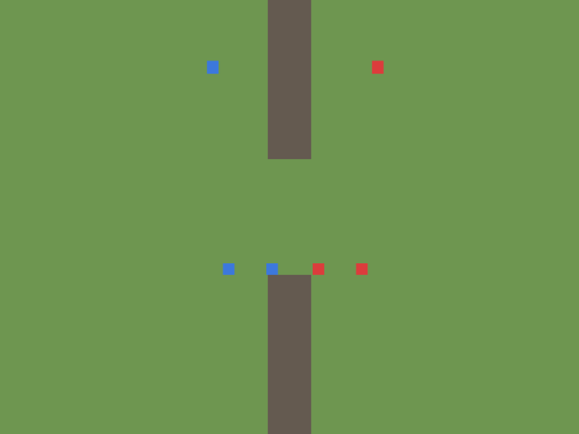 |
| **Stage 6a.** The battle sim at 8 vs 8: soldiers, seeking, knives, pistols, shotguns | **Stage 6b.** A wall with a gap: movement around it, and line of sight for guns |
| 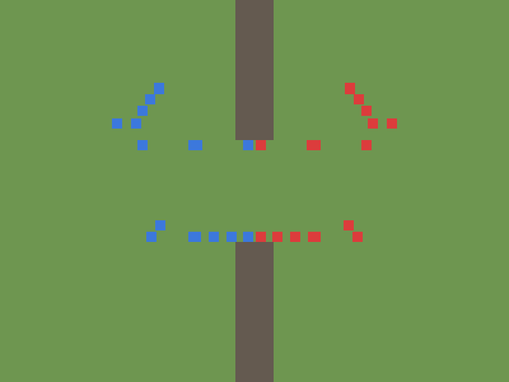 | 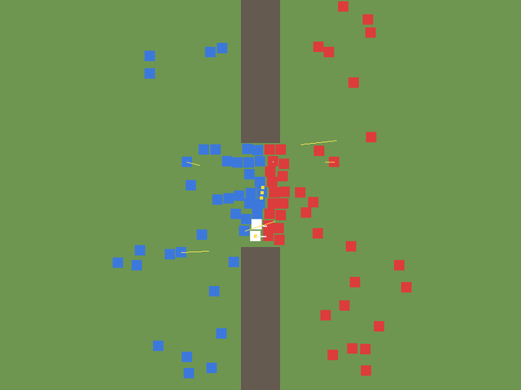 |
| **Stage 6c.** 50 vs 50, all piling into the gap | **Stage 7.04.** Attack animations: tracers, shotgun fans, knife thrusts, hit flashes |
| 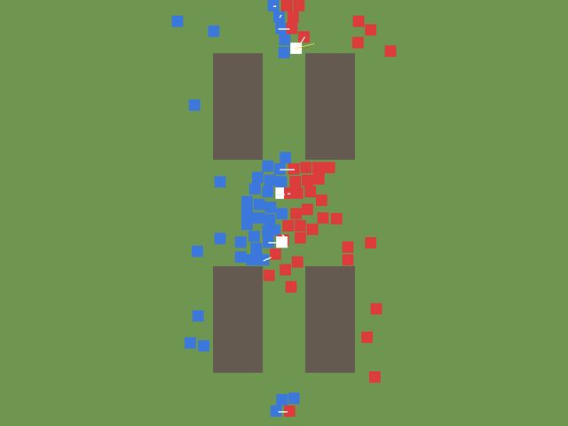 | 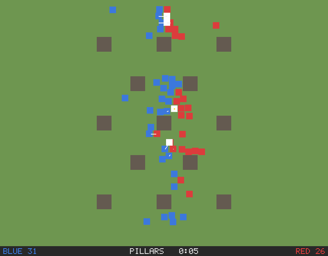 |
| **Stage 7.07.** Five mirrored arenas (this is Crossroads) | **Stage 7.11.** A scoreboard in a hand-made 5×7 font |
| 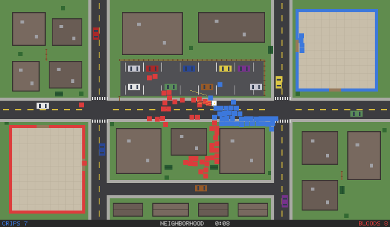 | 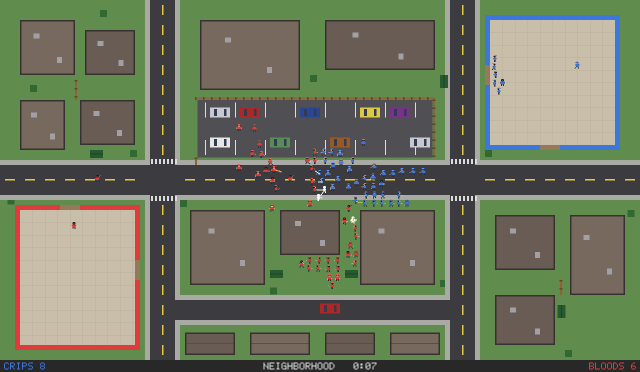 |
| **Stage 7.13.** The neighborhood: Crips and Bloods out of their apartment complexes, cars as cover | **Stage 8.01.** Hand-made pixel-art soldiers: 8 facings, a walk cycle, gang colours |
| 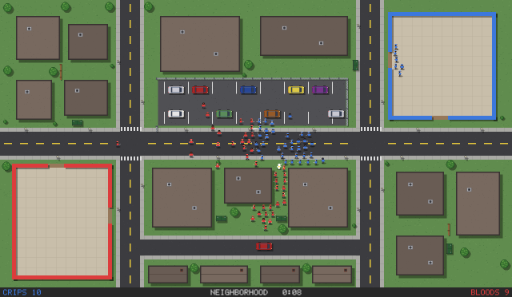 | 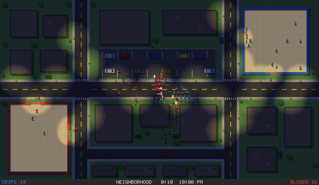 |
| **Stage 8.03.** Props and shadows: trees, fences, dumpsters, rooftop units | **Stage 8.05.** Day and night, with streetlights and lit lobbies |
| 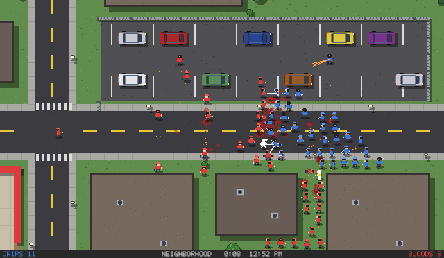 | 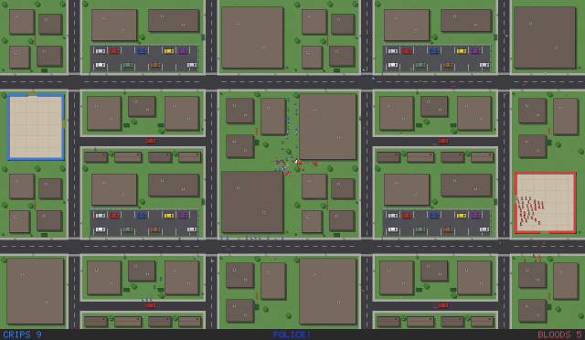 |
| **Stage 8.06.** A camera: zoom in toward the cursor, pan with W A S D | **Stage 9.01.** A map 16 screens big, drawn only where the camera looks (a stand-in, zoomed out) |
| 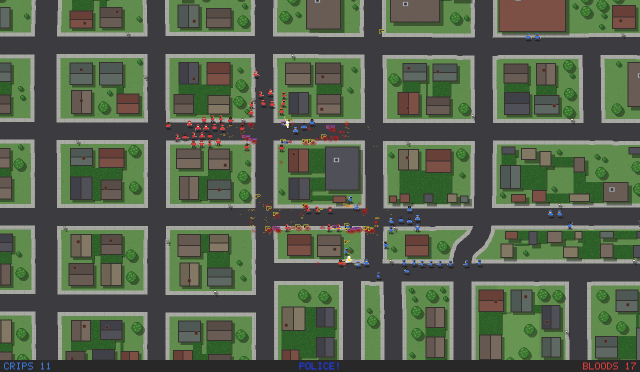 | 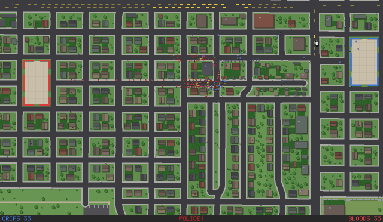 |
| **Stage 9.02.** Real streets from OpenStreetMap, compressed about 5×: generated houses along them | **Stage 9.02**, zoomed all the way out: a quarter of the map, with both homes |
| 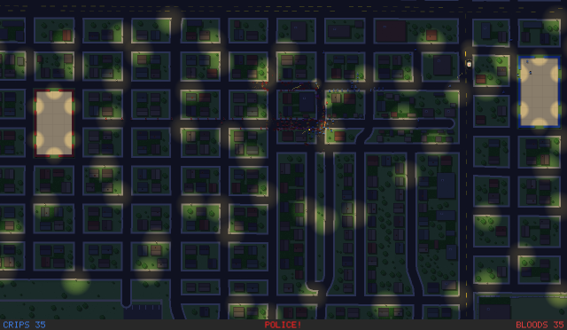 | 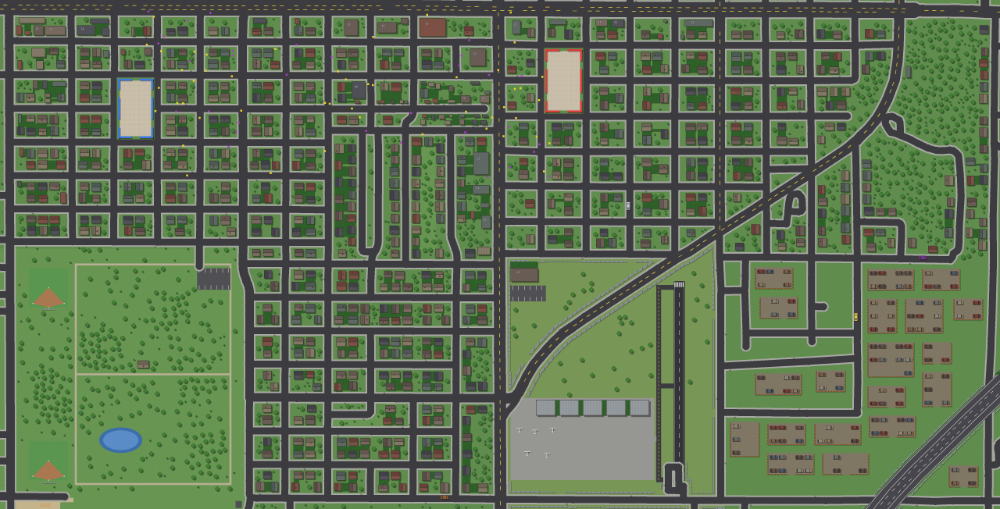 |
| **Stage 9.02** at night | **The whole south side map** (from its generator): neighborhoods, a park in the south-west, an airport in the middle south, wrecker lots in the south-east |

And stage 7.06, the demo this README used to open with:

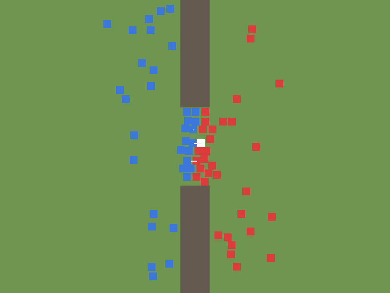

## Quick start

Linux x86-64 (developed on Ubuntu):

```bash
sudo apt install nasm gdb build-essential libsdl2-dev
git clone https://github.com/BlueFalconDevelopment/assembly-simulation.git
cd assembly-simulation/stage9
make
./build/03_bfs               # Crips vs Bloods; mouse wheel zooms, W A S D pans; TIME=21 for night
```

The winner is printed to the terminal when one team is wiped out, for
example `Team 0 (blue) wins on Pillars! (friendly fire: 0 hits, 0 kills;
held fire 1954 times)`. The window stays open on the last frame until you close
it.

Every stage directory works the same way: `make` builds each `.asm`
file in it into `build/`. Stage 0 is the one exception, a single
syscall-only `hello.asm` built without gcc or libc:
`nasm -f elf64 hello.asm -o hello.o && ld hello.o -o hello`.

## How the project is organized

Each stage is a directory of small numbered programs, and each one
builds on the one before it. Every stage has its own README, which is
the real changelog: what each file adds and, from 6a on, the real bugs
found while checking it and how they were fixed. The source is heavily
commented. Most files end with "try this in gdb" exercises and
questions meant to be answered by experimenting.

| Stage | What it adds |
|---|---|
| [`stage0_smoketest`](stage0_smoketest) | Toolchain check: nasm, ld and gdb on a hello world |
| [`stage1`](stage1) | Registers, arithmetic, the stack, `cmp`/jumps, the System V calling convention. Raw Linux syscalls, no libc |
| [`stage2`](stage2) | Linking SDL2 from assembly: open a window, clear it, handle quit, a frame-timed loop |
| [`stage3`](stage3) | A raw pixel buffer with byte offsets computed by hand, `set_pixel`/`fill_rect`, and Bresenham `draw_line` |
| [`stage4`](stage4) | State-driven animation, then real double buffering |
| [`stage5`](stage5) | Keyboard and mouse input: the point where the "scene" becomes a "sim" |
| [`stage6a`](stage6a) | The battle sim at 8v8: soldier structs, seek AI, knife/pistol/shotgun combat, pickups, win condition |
| [`stage6b`](stage6b) | Obstacles, movement that routes around them, line of sight for ranged fire |
| [`stage6c`](stage6c) | Scale to 50v50, plus the headless `batch.sh` harness |
| [`stage7`](stage7) | Past the roadmap: collision, random mirrored spawns, xorshift RNG, attack animations, friendly fire, hold fire, arenas, pathfinding, respawns, the neighborhood, random encounters, the Big Homie |
| [`stage8`](stage8) | Graphics, one drawing-only step at a time: hand-made pixel art for soldiers, pickups, cars and the dog, then props, shadows, ground effects, day and night, and a zoomable camera |
| [`stage9`](stage9) | Scale: a map sixteen screens big, drawn only where the camera looks, then real streets from OpenStreetMap, and five times faster headless |
| [`stage10`](stage10) | The game (in progress): a delivery rider working through the gang war. Starts by splitting the source into modules |

In `stage7`, each numbered file is the previous one plus one change:

| File | Change |
|---|---|
| `01_collision` | Soldiers can't overlap |
| `02_random_spawn` | Random spawn points, mirrored between teams so every map is fair |
| `03_xorshift` | libc's `rand()`/`srand()`/`time()` replaced with a hand-rolled xorshift64 seeded from `rdtsc` |
| `04_attack_fx` | Knife thrusts, tracers, shotgun fans, sparks and hit flashes. Drawing only: proven not to change the fight |
| `05_friendly_fire` | Shots hit the first soldier in the line of fire, on either team |
| `06_hold_fire` | Soldiers side-step instead of shooting through a teammate |
| `07_arenas` | Five mirrored wall layouts, picked at random or with `ARENA=n` |
| `08_headless` | `HEADLESS=1` runs a whole game in about 0.16s with no window, for fast batches |
| `09_pathfinding` | Flow-field pathfinding around walls; `SEED=n` replays a game; Zigzag maze arena |
| `10_traffic` | Pathfinding also steers around other soldiers: 0 stalemates in 6,240 games |
| `11_scoreboard` | A scoreboard under the field in a hand-made 5×7 pixel font |
| `12_respawn` | Respawns in a safe zone, first to 200 kills wins; `RESPAWNS=n`, `LIVES=n`, `SCORE_LIMIT=n` |
| `13_neighborhood` | A 1280×720 city neighborhood: Crips vs Bloods out of their apartment complexes, cars as low cover |
| `14_events` | Random encounters: a police car that shoots and arrests, and a pitbull that slips its leash |
| `15_bighomie` | A miniboss, the Big Homie, for the gang that's losing (`BOSS_AT=n`) |
| `16_tuning` | Soldiers flee off the road from the police; the Big Homie comes out earlier |

In `stage8`:

| File | Change |
|---|---|
| `01_sprites` | Hand-made 16×16 pixel-art soldiers: 8 facings, a walk cycle, gang colours, the weapon in hand |
| `02_details` | Pixel-art weapon pickups, police car, dog and parked cars |
| `03_props` | Shadows, trees, bushes, dumpsters, fences, rooftop AC units, streetlights, textured ground |
| `04_ground` | Blood splats, shell casings and a death animation that stay on the street |
| `05_night` | Day and night: time passes, streetlights, lit lobbies, headlights and muzzle flashes light the dark |
| `06_camera` | Mouse-wheel zoom toward the cursor, and W A S D to move the camera |

In `stage9`:

| File | Change |
|---|---|
| `01_world` | A 5120×2880 map (a stand-in: stage 8's neighborhood tiled 4×4), with the map data in its own files; each frame draws only the camera's view, which can now zoom out to a quarter of the map |
| `02_southside` | A real city's south side from OpenStreetMap, compressed about 5× to 5120×2608: real streets, generated houses, a park, an airport, wrecker lots, a fenced expressway; the generator plugs every gap a soldier could get stuck or jammed in |
| `03_bfs` | Five times faster headless, the same games byte for byte: the flow-field searches skip a divide per cell and only run as far as a soldier asking for directions needs |

In `stage10`, each step is a folder (`main.asm` plus its modules):

| Step | Change |
|---|---|
| `01_modules` | The source split into 21 modules, one per concern; the same machine code as 9.03, byte for byte |
| `02_factions` | Two teams become factions, with a table of who fights whom and a flow field per faction; the same game, byte for byte |

[`assembly-project-plan.md`](assembly-project-plan.md) is the original
roadmap, with its status and a list of hard-won traps to avoid.

## Verification

A single game of a random simulation proves almost nothing about
whether it's fair, so every gameplay change here is checked by playing
many games and counting wins:

```bash
cd stage7
STAGGER=0 ./batch.sh 48     # 48 headless games of the newest binary at once
```

`batch.sh` runs the unmodified binary with no window (SDL's `dummy`
video driver plus the software renderer). It stops each game when its
win line appears and tallies wins, `STUCK` games (no winner before the
timeout) and `CRASH`es. A few of the problems that counting wins
caught, all documented in the stage READMEs:

- a turn-order advantage that gave team 0 11 of 12 games, counted by
  hand before the harness existed (6a)
- a side-step rule that was "the same for both teams" but meant
  *toward* the enemy for one and *away* for the other: 9–39 (6c)
- a first batch that reported 16–0 because every game got the same
  `time()` seed, making it one game played sixteen times (6c)
- a 1px asymmetry, because a 16px box has no centre pixel, that tilted
  hold fire toward one team. Fixed by walking lines of fire in
  half-pixel units (7.06)

For changes that should *not* alter the fight, like the animations,
gdb gives a stronger check. Fix `rng_state` to the same seed in two
builds, run each to the end, and compare the whole game state byte for
byte.

## Write-ups

The whole journey, bugs included, is written up as a four-part blog
series:

1. [Bare Metal Deathmatch: Teaching Myself x86-64 Assembly From Scratch](https://tech-blog-bluefalcon.netlify.app/blog/bare-metal-deathmatch/) (Stages 0–6b)
2. [Bare Metal Deathmatch II: Fifty a Side, and a Coin That Kept Landing Heads](https://tech-blog-bluefalcon.netlify.app/blog/bare-metal-deathmatch-2/) (6c, 7.01–7.02)
3. [Bare Metal Deathmatch III: Tracers, Friendly Fire, and a Box With No Middle](https://tech-blog-bluefalcon.netlify.app/blog/bare-metal-deathmatch-3/) (7.03–7.06)
4. [Bare Metal Deathmatch IV: Walls as Data, and a Game With No Window](https://tech-blog-bluefalcon.netlify.app/blog/bare-metal-deathmatch-4/) (7.07–7.08)

## The stack

- **[NASM](https://nasm.us)**, the assembler (Intel syntax)
- **System V AMD64 ABI**, the calling convention that makes calling SDL2
  from assembly possible
- **gcc**, used only as the linker driver (`-no-pie` is required to call
  C functions from hand-written asm with a plain `call`)
- **gdb** for debugging, and for most of the verification above
- **[SDL2](https://www.libsdl.org)** for the window, input and pixel
  blitting

## License

[MIT](LICENSE)
