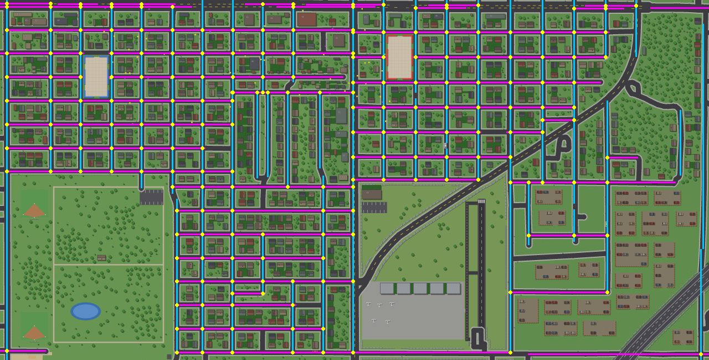
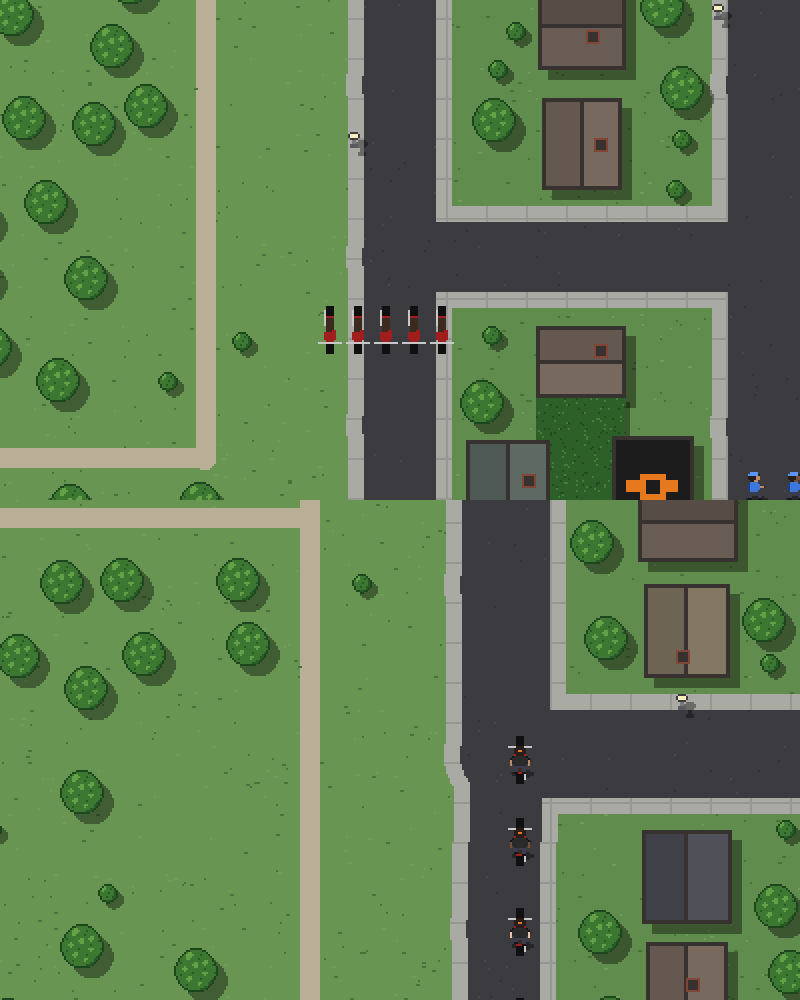

# Stage 10 — The game

Stage 9 ended with a fast, well-tested simulation on a real city's
streets. Stage 10 turns it into a game: you're a delivery rider
(a bicycle to start, a van one day) making timed runs through the
gang war for money, and spending it on guns, armor, vehicles and
abilities. Biker packs, a cartel hit team and the good ole boys join
the chaos later. The full roadmap is the "Stage 10+" section of
[`assembly-project-plan.md`](../assembly-project-plan.md).

The simulation stays as the test harness: `HEADLESS=1` runs it with
no player, so batches and the fixed-seed checks keep working.

## Build

```bash
make                          # every step
./build/09_police             # the latest: the game (ENTER starts a shift; saves to ~/.courier_save)
MODE=watch ./build/09_police  # last gang standing, no player (the default headless)
STAGGER=0 ./batch.sh 48       # headless, 4 games at a time
python3 tools/gen_southside.py                      # rebuild maps/southside3.* (17 s)
python3 tools/score_pairs.py build/09_police     # re-score the home pairs (~40 min)
PAIR=0 ./build/09_police                         # a given pair of homes
MODE=game STAGGER=0 ./batch.sh 48                   # 48 endless wars, headless
python3 tools/gen_sprites.py --write 09_police/sprites.asm
python3 tools/gen_vehicles.py --write 09_police/vehicle_art.asm
HEADLESS=1 SEED=21 gdb -batch -x tools/profile.py ./build/09_police
```

**Steps are folders now.** Each step is `NN_name/`: a `main.asm` and
the modules it `%include`s, copied from the step before, so every step
still builds on its own and the history stays readable. The map
(`maps/`) and the tools (`tools/`, `batch.sh`) are shared, copied from
stage 9. The Makefile builds `NN_name/main.asm` to `build/NN_name`,
with the folder on NASM's include path (`-i`), and rebuilds a step
when any of its modules or anything in `maps/` changes.

## `01_modules/` — the source, split into modules

`stage9/03_bfs.asm`, cut into 22 files: `main.asm` (the header, the
externs, and the list of modules) and 21 modules, one per concern:

| Module | What's in it |
|---|---|
| `constants.asm` | constants, the map include, structs, colours |
| `data.asm` | settings, messages, counters, event state, framebuffers, the font |
| `sprites.asm` | the pixel art (written by `tools/gen_sprites.py --write`) |
| `tables.asm` | palettes, camera, day-and-night keys, gang colours, flow directions |
| `bss.asm` | grids, fields, buffers, soldiers, pickups |
| `game.asm` | `main` (the loop), the RNG, spawning, reading settings |
| `pathfinding.asm` | the walkable grid and the flow fields (BFS, `flow_waypoint`) |
| `hud.asm` | the font renderer and the scoreboard |
| `respawn.asm` | rules from the environment, respawns |
| `background.asm` | the pre-drawn map, shadows |
| `camera.asm` | the view: copying it, zoom, pan |
| `lighting.asm` | day and night |
| `ground.asm` | blood, casings, pools |
| `draw_sprites.asm` | sprites, soldiers, the dog walker |
| `bosses.asm` | the Big Homie |
| `events.asm` | the police and the dog |
| `ai.asm` | targets, weapons, the blockmap, line of sight, `update_soldiers`, `first_in_line` |
| `results.asm` | the win line |
| `effects.asm` | attack effects |
| `win.asm` | `check_win` |
| `primitives.asm` | `set_pixel`, `fill_rect`, `draw_line` |

**The order is the program.** NASM lays code and data down in the
order it reads them, so the modules are `%include`d in exactly the
order their code stood in 9.03, cut at the banner comments (or the
comment block above a function). Only comments moved: the "Build and
run" footer is at the end of `main.asm` now. The code modules each
open with `section .text`, which changes nothing, since they were all
in `.text` already.

**Proof.** Built with 9.03's window title, the two binaries' `.text`
and `.data` sections are identical, byte for byte, at the same
addresses (`objcopy -O binary -j .text`, then `cmp`): the same
program. With the title changed to "Stage 10.01", the usual
fixed-seed check: the end state (`soldiers`, `pickups`, `rng_state`,
`ticks`) is identical to 9.03's for 12 seeds headless and one
windowed. And `gen_sprites.py --write` on a copy of `sprites.asm`
writes it back unchanged.

## `02_factions/` — factions instead of two teams

`01_modules/` with the two teams generalized into factions: the
groundwork for everyone who joins the fight later (Bikers, the cartel,
the good ole boys, the police, the player). The same game, byte for
byte.

**Factions.** `Soldier.team` is a faction now: 0 the Crips, 1 the
Bloods, and `NUM_GANGS` = 2 of them are gangs. `MAX_FACTIONS` = 8
slots in all. `score`, `tickets`, `boss_state`, `home` and `fwd_sign`
are sized for every faction (`times MAX_FACTIONS`).

**Who fights whom is a table.** `hostility` in `data.asm` is an
8 × 8 byte table: row a, column b is 1 if faction a attacks faction b.
The `HOSTILE dst, a, b` macro (`constants.asm`) reads it: one `lea`
(the row times 8, plus the column), an `add` of the table's address
and a `movzx`, with the flags set for a `jz`/`jnz` straight after.
Every place that used to ask "a different team?" now asks the table:

- `find_nearest_enemy`: only factions we fight are targets
- hold fire: someone we don't fight first in the line of fire
- friendly fire: a hit on someone we don't fight
- scoring: only kills of an enemy count
- a respawn spot's safety: distance to the nearest enemy
- the flow fields' sources (below)

**One flow field per faction.** `field_for` holds a field per
faction, each meaning "toward everyone this faction fights", and
`bfs_states` a lazy search for each (9.03). `build_fields` seeds
faction f's field with every living soldier that f is hostile to. With
two gangs at war, the Crips' field is exactly 9.03's "toward the
Bloods", so every value read is the same. A soldier follows its own
faction's field; `bfs_ensure` works out which faction a field
belongs to from where it lies in `field_for`.

**Still between two gangs:** the Big Homie ("the other gang" is gang
xor 1), the scoreboard, the win lines and `batch.sh`'s tally. They
change when a third gang (or the player's own scoreboard) needs them
to. `check_win` is general already: the last gang standing among any
number of gangs, reporting the highest-numbered gang when the last
ones all go out at once, as 9.03 reported the Bloods.

**Proof.**
- The end state is identical to 10.01's for 12 seeds headless and
  one windowed.
- A copy with `MAX_FACTIONS` = 4 (and a 4 × 4 table) plays
  identically: the indexing follows the constant.
- A copy with an all-zero table plays a war where nobody fights:
  score 0–0, a stalemate at 30,000 ticks. The only deaths are the
  police's and the dog's, which don't use the table yet.

About 4% slower (1.71 s a game): six empty fields get seeded each
tick.

## `03_fair_homes/` — fair homes, chosen at random

`02_factions/`, with the gangs' homes picked at random each game from
pairs of sites that batches showed are fair. 9.02's two fixed homes
gave the west one about 62% of the wins.

**Six sites.** `tools/gen_southside.py` now places `SITES` = 6
apartment complexes. The first two are 9.02's homes (SW 20th &
Monroe, and SW 9th & Jefferson). The rest are chosen one at a time: of
every street-and-avenue corner outside the park, airport and wrecker
lots whose two-block complex fits 50 soldiers and covers no real
building, the one farthest from those already picked. They came out
in the south-middle neighbourhood (2), by the loop road in the
north-east (3), the middle west (4) and the middle east (5). Houses
keep clear of all six.

**Candidate pairs.** Any two sites 1,500–3,600 px apart: nine of
them. For each, the generator closes the other four (their doorways
count as walls), checks the map is connected and both lobbies are in
the main part, and lays 80 pickups mirrored between the two lobbies.
A pair's pickups are seeded by its two sites, so they're the same
whichever other pairs are in the map.

**Scoring.** `tools/score_pairs.py` plays each pair headless
(`PAIR=n`, through `batch.sh`, 4 games at a time) and counts how often
the gang in the pair's first site wins. The side swap is still random,
so the gangs stay even; what's measured is the sites. 96 games each,
then 480 for any pair within 15% of even. Results, in
`maps/pair_scores.json`:

| Pair | Sites | First site won | Kept |
|---|---|---|---|
| 0–1 | 20th & Monroe, 9th & Jefferson (9.02's) | 48.8% of 480 | yes |
| 1–3 | 9th & Jefferson, the north-east | 53.9% of 960 | yes |
| 4–5 | middle west, middle east | 53.3% of 480 | yes |
| 2–3 | | 58.7% of 479 | no |
| 2–5 | | 42.3% of 480 | no |
| 0–2, 0–5, 1–2, 3–4 | | 71%, 85%, 82%, 29% of 96 | no |

The generator keeps the pairs within 4.5% of even over at least 480
games (about 2 standard deviations), and writes only those into the
map. Pair 0–1 is even now: with more sites and each pair's own
mirrored pickups, 9.02's 62% lean is gone.

**A lean that came back.** The final batches (144 games, random pairs)
had pair 1–3 at 30 of 42 for site 1, where scoring had found 50.4%.
A fresh sample of 480, decided on before looking further, gave 57.3%.
Its map was checked to be identical (the same pickups, the same
closed sites), so it's sampling: pooled, 517 of 960, 53.9%, a small
lean that the first 480 happened to hide. It stays in (within 4.5%),
and the scores file records the pooled numbers. 480 games only
resolves a pair to about ±4.5%; a stricter cut would need 2,400 each.
The gangs are even regardless: the coin flip gives each gang the
better site half the time.

**In the game.**
- `choose_sides` picks a pair (`PAIR=n` names one), then flips a coin
  for which gang gets which site, as before; `fwd_sign` comes from the
  two lobbies' positions.
- Spawns, respawns, pickups (`pair_pickups`), the lobby and door
  lights, and the starting camera (`camera_start`, halfway between the
  homes) all follow the pair.
- The four closed sites: `build_blockmap` marks their doorways as walls,
  so the pathfinding grid never goes in; `render_background` draws
  their walls and doorways grey, and a flat roof over the lobby.
- The win line says `; homes a-b; crips home s`: how the batches score
  a pair.

**Versioned map files.** The map's format changed, and `maps/` is
shared by every step, so the new map is `maps/southside2.inc` and
`maps/southside2_bg.bin`. 10.01 and 10.02 keep including 9.02's
`southside.inc`, unchanged, which `stage9/tools/gen_southside.py` can
still regenerate. From now on, a format change gets a new name.

**Checks.** 144 games with random pairs: no stalemates or crashes,
Crips 67 – Bloods 77, the pairs' first sites 80 of 144 (z 1.3). One
game of the dropped pair 2–3 didn't finish during scoring (1 in about
2,900); the kept pairs had none in 2,064 games.

## `04_endless/` — the endless war

`03_fair_homes/` with two modes, set with `MODE=` (`read_mode`):

- **watch**: last gang standing, exactly as before. The default when
  `HEADLESS`, so batches, replays and the fairness checks carry on
  unchanged. Byte for byte: the same seed ends the same as 10.03, for
  12 seeds headless and one windowed (`MODE=watch`).
- **game**: the endless war the game will be played in. The default
  in a window. Unlimited lives and respawns and no score limit,
  whatever `LIVES`, `RESPAWNS` and `SCORE_LIMIT` say; `check_win` never
  ends it. Closing the window prints how the war went ("Endless war
  on South Side! ..."), and `HEADLESS=1 MODE=game` plays one to
  `MAX_TICKS` (30,000, about 8 minutes of game time) and prints the
  same line, so wars can be batched (`batch.sh` counts them as
  "stuck": there's no winner).

**The Big Homie comes back.** He came out once per gang per game. In
an endless war, once a gang's Big Homie is dead it can bring him out
again, when it has fallen `BOSS_KILL_GAP` kills further behind than it
was when he died (`boss_base`, 0 in watch mode). The win line now
counts his outings (`boss_count`), which in watch mode is the same 0
or 1 as before.

**The guns piled up.** The first 48 wars were balanced (959 kills a
war to 962) but some were quiet: 1,306 kills in one, 2,567 in another.
Sampling the quietest every 1,000 ticks showed the kill rate falling
from about 50 to about 15 after 3,000 ticks, and armed soldiers from
15–20 a side to 4–6. At tick 10,000, 69 of the 80 guns were on the
ground: all in a heap in one street, between the two crowds, where
the dead had dropped them and nobody lived long enough to pick one
up. The respawned knife carriers queued behind the front for them.
Watch-mode games end at about 4,700 ticks, so it had never shown.

So in game mode a gun that has lain on the ground `PICKUP_STALE`
ticks (900, 15 s) is "picked up by someone else": `refresh_pickups`
moves it to one of the pair's pickup spots, at random. It's the same
gun, so every weapon is still in exactly one place. (`pickup_age`
counts; `drop_weapon` resets it.) The same war afterwards: 70–100
kills per 1,000 ticks from start to end, 10–30 guns a side, and real
swings of momentum.

**48 wars** (random pairs): 1,877–2,836 kills each, Crips 1,107 and
Bloods 1,086 a war on average, the Crips ahead in 30 of 48 (z 1.7),
no crashes. The Big Homie came out 0.8 and 1.4 times a war, up to 4.

## `05_on_foot/` — you, on foot

`04_endless/`, and you're in it: in game mode, in a window, a courier
on foot in the middle of the war. Everyone is hostile.

| Control | What it does |
|---|---|
| W A S D | walk (3 px a tick, the soldiers' 2), sliding along walls; the camera follows you |
| right-click | lock onto the enemy nearest the cursor (within 120 px); yellow brackets mark him. Right-click nobody to unlock; the lock breaks when he dies or gets 450 px away |
| left button | fire: at the lock, when he's in range and in sight (otherwise it holds fire: no ammo wasted); with no lock, at the enemy nearest the cursor (within 40 px); with nobody there, a miss with a tracer toward the cursor. Whoever is first in the line of fire takes the shot |
| Q | swap pistol and shotgun (an empty gun swaps itself for a loaded one) |
| walk over a gun | take its ammo: +20 pistol rounds or +8 shotgun shells. The gun turns up again at one of the pair's pickup spots, so the gangs' supply doesn't shrink |
| wheel | zoom; game mode starts at 2× (at 1× you're 16 px on a 1,280 px screen) |

**Tougher than a gang member:** 150 health against their 100, and it
comes back (a point every 20 ticks once you've gone 4 seconds
unhurt); an 85% pistol hit chance against their 60%, 34 damage against
their 20 (three hits kill), and faster fire (14 ticks against 20).
The shotgun: 95% and 60 damage inside 80 px, 65% and 30 out to 180.
60 pistol rounds a life, no shells. Dying shows YOU DIED on the
scoreboard, and 3 seconds later you're back somewhere safe: a walkable
spot outside every site, at least 700 px from both homes, 300 px from
anyone alive and 100 px in from the edges. The scoreboard's middle
shows your health, gun, ammo and kills; the summary line (when the
window closes) adds "; you: kills K, deaths D".

**The gangs only come after you up close.** A gang member considers
you a target only within 450 px, about three blocks
(`find_nearest_enemy`); beyond that it gets back to the rival gang.
And you're not a source of the gangs' flow fields, so gangs across
the map don't converge on you. Stray bullets still hit you.

(That's the second version. The first, from the plan, had 100 health,
the soldiers' own odds, no pickups, a 28 px aiming radius and every
gang member on the map after you. The first play test: "aiming feels
hard", "you feel incredibly underpowered", "can't pick up the guns",
"the gangsters should ignore you after so many blocks".)

**You're a soldier.** The player is the slot after the two Big Homies
(`PLAYER`), in a faction of its own (`FACTION_PLAYER` = 2), which the
hostility table sets at war with both gangs, both ways. So the rest of
the game handles you with the code it already had: the gangs pick you
as a target, their shots hit you when you're first in the line of
fire, you collide like a soldier, you're drawn and shadowed like one
(a courier's yellow shirt and a brown cap), the police arrest you and
the loose dog bites you. What's different, in `player.asm`:

- `update_soldiers` skips your slot: `update_player` moves you, from
  the keyboard and the mouse, once a tick before the soldiers.
- Your `lives_left` is 0, so the generic respawn never books you, and
  neither kill path drops your pistol: `update_player` brings you back.
- Your shots go through `event_damage` (spawn protection counts; a
  kill drops the victim's gun and books its respawn, as usual) and a
  kill of an enemy scores for your faction.
- Your own RNG, `player_rng`, seeded from the game's seed: nothing you
  do moves the soldiers' random numbers.
- A missed shot's tracer aims at a point: `spawn_effect` takes target
  −1 to mean `fx_dst`, as shooter −1 already meant `fx_src`.

**Only in game mode, in a window** (`player_on`). Watch mode and
`HEADLESS` have no player: the end state is identical to 10.04's for
12 seeds headless and one windowed.

**Tested with a bot.** The dummy video driver has no keyboard or
mouse, so a gdb script plays: every tick it aims at the nearest enemy
and walks toward it (writing SDL's keyboard state array) until it's
within 190 px, then holds the button, right-clicking every 2 seconds
to lock on. It has no pathfinding, so when a building stops it for a
second it hops to a clear spot near its target (checked with the
game's own `is_box_blocked`). Over 4,859 ticks: 30 kills, 7 deaths (the
first version's player: 2 kills, 6 deaths in 4,000). A second script
stood the player on a pistol and a shotgun: 60 → 80 rounds, 0 → 8
shells, and both guns turned up elsewhere.

**A bug the bot found: `imul r8d, edx, edx`.** The three-operand
`imul` takes an immediate as its third operand, not a register, but
NASM assembled it anyway, into bytes the CPU refuses: SIGILL, the
moment `enemy_near` first ran (the first right-click). The bot saw it
as a gdb MemoryError (it was reading a dead process) until gdb was
told to stop on SIGILL. Now it's `mov r8d, edx` then `imul r8d, edx`.

## `06_bicycle/` — the bicycle

`05_on_foot/`, on a bike: the first rung of the vehicle ladder
(bicycle, moped, motorcycle, car, van). You spawn riding it.

| Control | Riding |
|---|---|
| W A S D | point where you want to go, 8 ways, as when walking: the bike turns toward it (a quarter turn in 7 ticks) and pedals while it's pointing roughly that way, slowing for a sharp turn. No keys: it brakes to a stop |
| E | get off, beside the bike (the first clear side); near it on foot, get back on ("E: RIDE" on the scoreboard) |
| mouse, Q, wheel | as on foot; your hit chance is 15% worse riding (one hand on the bars) |

Up to 4 px a tick, against walking's 3, in 21 ticks from standing.
Walls stop you and you slide along them. Soldiers don't: riding into
one bumps him 12 px aside, off your line, and slows you to 3/4; at
2 px a tick or more it's a ram, which hurts him (speed × the bike's
mass / 8: 16 at top speed, through `event_damage`, so it's your kill if
he dies), costs you 5 and the bike 6 (of 60), and slows you to 2/3.
Then you ride on through. Worn to 0, the bike is a grey wreck you
can't ride until you respawn (on a new one).

**The first version was "insanely hard to control".** It steered like
a tank: A and D turned, W pedalled, S braked and reversed, and it
went up to 5 px a tick. Soldiers stopped it dead. The play test: hard
to control, "the bike should bump them and slow you but not stop
you", and the speed "a little too much. If the bike is this fast, by
the time you get a car the car is going to be going too fast." So now
you point where you want to go, soldiers bump aside, and the bike's
4 px a tick sets the scale for the ladder: about a pixel a rung
(moped 5, motorcycle 6, car 6 but tougher, van 5).

**One engine, a table of vehicles.** `vehicles.asm` has the physics
once, driven by a row of `vehicle_types`: top speed, acceleration,
braking, drag (for sharp turns), turn rate, mass, health, capacity (for
deliveries, 10.07), aim penalty, sprites and palette. The bicycle is
row 0; the other rungs will be more rows and more art, not more code.

**Position in 1/16 px.** The vehicle's centre is kept in sixteenths of
a pixel, its heading as 0..255 (0 east, 64 south), and its speed in
sixteenths a tick, so it accelerates and turns in an arc. The keys'
direction is a heading from a 3 × 3 table (`key_heading`); the bike
turns toward it the short way round, at most its turn rate a tick.
The step along the heading comes from a 256-entry sine table (×256):
`dx = speed · cos / 256`, `dy = speed · sin / 256`, with `sar` for the
signed division. Riding, you are where the bike is: the player's
soldier box is centred on it, so the gangs still target you, shoot
you and bump into you as before.

**Collisions.** Each tick the bike tries the whole step, testing the
box there against walls and props (`is_box_blocked`) and soldiers
(`soldier_at`). A wall: each axis alone (sliding, at 3/4 speed), else
stop. A soldier: `vehicle_bump` works out which side of your line he's
on (the cross product of the heading and the vector to him), pushes
him 12 px that way, square to the heading (if the spot's clear), and
the bike moves on regardless.

**The art** comes from a new tool, `tools/gen_vehicles.py`: a vehicle
is a few rectangles in its own frame (the bicycle: two tyres, a frame,
handlebars, a saddle), and each of 16 headings is rendered by sampling
every output pixel's centre rotated back into that frame. One drawing,
16 facings. It writes the step's own `vehicle_art.asm` (with the sine
table), so `gen_sprites.py` and older steps are untouched. The bike is
23 px long on a 24 px sprite, longer than the 16 px rider on top of
it: at first it was 16 px, and the rider hid all but the tyre tips.

**Tests.** Watch mode has no player and no bike: byte-identical to
10.05 for 12 seeds. A gdb script rode it on Lee Blvd: D took it east to
top speed (64 sixteenths), S turned it south in 8 ticks at full speed,
W swung it round to north (slowing to 43 in the turn), no keys braked
it to 0, and E put the rider off to the side and back on. Another held
a Crip in its path until contact: 100 → 84, shoved 12 px aside, the
bike slowed to 42 and rode on through, back at top speed 20 px later.

## `07_deliveries/` — deliveries

`06_bicycle/`, with the job (`deliveries.asm`): pick up a package at a
business, deliver it to a house, get paid.

| Control | |
|---|---|
| 1, 2, 3 | take a job from the board |
| X | drop the job (and the package) |

**The board** is the scoreboard's new second row (it's two rows now,
`HUD_H` 40: the window is 16 px taller). Your money is on the left;
in the middle, three offers, each a business and a house at least
600 px apart: "1) $72 1.2KM !!!!!  2) $34 0.9KM  3) $38 1.1KM". Take
one and the row says where to go, with a yellow marker round the
business's door (and a yellow pip at the edge of the screen pointing
to it when it's off-screen). Pick the package up by standing there;
now it's a green marker at the house, and a clock. On time, the full
pay; late, half. Dying loses the package, and X drops it; either way,
three new offers. The summary line when the window closes adds your
deliveries and money.

**Pay and time.** $10, plus $1 for every 60 px of straight line, plus
$6 for each level of danger (0 to 5): the gang members alive within
200 px of 8 points along the line from the business to the house,
when the offer is made, halved. So a short run through a war zone
pays better than a long quiet one ($72 for 1.2 km at danger 5, $34 for
0.9 km at none, in the test). The clock: 300 ticks plus 3/4 of a tick
per px. All of it uses the player's RNG.

**The map's new lists** (`maps/southside3.*`, `tools/gen_southside.py`):
`biz_points`, a door spot for each real building (the side nearest a
street first), and `house_points`, one for each generated house (on
the side facing its street). A spot is kept only if a soldier's box
fits there and it's in the main connected part of the map with every
fair pair of homes: 76 of 76 businesses, 572 of 595 houses. The first
try put the spots 2 px from the wall, and only 204 houses passed: a
9 px grid cell is walkable only if a 24 px window is clear, and a box
2 px from a wall is in cells that aren't. At 10 px out they pass. The
background is byte-identical to `southside2`'s.

**Four glyphs.** The font had no `$`, `)`, `+` or `>`; now it does.

**A bug found on the way: the summary line had outgrown its buffer.**
`msg_buf` was 160 bytes; with the home pair (10.03) and your stats
(10.05) the line reached 233 characters, running past it into
`title_buf` and, from this step, into the job board's `offers`. It's
512 now. (In 10.03–10.06 it only ever wrote past the end at the very
end of a game, into buffers nobody read again.)

**Tests.** Watch mode has no player: byte-identical to 10.06 for 12
seeds. A gdb script took job 2 (state 1), stood at the business (state
2, the clock at 1,388 ticks), then at the house: $34, one delivery. It
took another and ran its clock out before arriving: $56 offer, $28
paid. And X dropped a third. A frame capture showed the board, the
pick-up line and the edge pip.

## `08_shifts/` — shifts and saving

`07_deliveries/` becomes a game you come back to: a title screen,
shifts, and a save file (`shifts.asm`, `save.asm`).

| State | |
|---|---|
| title | The war goes on behind a dimmed view (W A S D pan, as in watch mode). "SOUTH SIDE COURIER", "A NEW SAVE" / "WELCOME BACK" / "YOUR SAVE WAS DAMAGED", your money and shifts, the controls, and "PRESS ENTER TO START YOUR SHIFT" |
| shift | You, on your bike, with the job board, and 3 minutes on the clock ("SHIFT 2:13", on the right of the scoreboard's second row) |
| summary | The clock ran out ("SHIFT OVER") or you died ("YOU DIED: SHIFT OVER"): deliveries, earnings, kills, anything lost, your total, and ENTER for the next shift. The shop goes here in 10.10 |

`player_on` now means "a shift is on": the player, the bike, the job
board and the camera following you all check it already, so they run
only then. A new flag, `courier`, is game mode in a window.

**Dying ends the shift.** The package is lost (as in 10.07) and so is
20% of the money you have; your gear stays. The fall plays out first
(the 3 seconds that used to be the respawn wait).

**The save file** is `~/.courier_save` (or `$SAVE`, or
`./courier_save` if there's no `$HOME`): 64 bytes of dwords.

| Offset | |
|---|---|
| 0 | magic, "CSV1" |
| 4 | version, 1 |
| 8 | money |
| 12, 16, 20 | shifts, deliveries, kills |
| 24 | best shift ($, before any penalty) |
| 28–59 | reserved (gear, from 10.09) |
| 60 | checksum: the sum of the first 15 dwords, xor `0xC0DE5A1E` |

Closing the window mid-shift ends the shift (so its deliveries and
kills count in the totals: the first play test's save had 6 deliveries
of 7, the seventh in a shift the window closed on) and saves.

It's written through raw Linux syscalls (`open`, `read`, `write`,
`close`, `rename`: no libc file functions), at the end of every shift
and when the window closes. It goes to `<path>.tmp` first and is
renamed over the save, so a crash in the middle of writing can't leave
half a save: `rename` replaces the file in one step. A save that's the
wrong size or has the wrong magic, version or checksum is treated as
none, and the title says so.

**Text on the view.** `draw_text` drew only on the scoreboard; now it
draws wherever `text_fb` points, and the overlays point it at the view
(dimmed twice with `shade_rect`), centred, a line every 24 view px. The
first version's controls ran off both sides at 2× zoom (a 640 px view
fits 53 characters), so they're three short lines.

**Tests.** Watch mode has no player: byte-identical to 10.07 for 12
seeds. With a gdb script and `SAVE=` pointing at a scratch file:

1. No file: "new"; ENTER started a shift (10,798 ticks on the clock);
   running the clock out wrote 64 bytes: `CSV1`, 1, $123, 1 shift,
   best $123.
2. Restarted: "loaded", $123, 1 shift.
3. One byte changed: "damaged", starting over at $0.
4. Dying with $500: the summary, "YOU DIED", $400 left ($100 lost).

## `09_police/` — the police leave you alone

`08_shifts/`, after the play test: "the police shouldn't shoot you and
they should avoid running you over".

- **The police are a faction** (`FACTION_POLICE` = 3) with a row in
  the hostility table: the two gangs, not you. `update_police` asks it
  whom to aim at and whom to arrest, instead of skipping the player's
  slot. (Their shots only ever hit the soldier they aim at, so none of
  theirs can hit you.)
- **The car won't drive into you.** `cop_blocked` looks at the strip
  just ahead of its bumper (as far as it moves in a tick, plus 4 px),
  for anyone alive the police won't hurt (you; riding, the whole 24 px
  bike, not just your 16 px box) or your parked bike. Something there:
  the car waits. From behind or the side, you don't stop it.
- **It doesn't wait for ever.** After 2 seconds (`COP_WAIT_MAX`) it
  turns round and goes back the way it came.

**A code review of the first version** (`/code-review high`) found
eight things, all real, all fixed here:

1. The car waited for as long as you stood there, with no time limit:
   no other police car could come, and every gang member within 280 px
   kept fleeing it instead of fighting you. A safe zone, with the
   officers shooting for you.
2. It stopped for you behind it or beside it too: on the bike (faster
   than the car) you could catch it up and freeze it with you inside it.
3. On the bike it stopped against your 16 px box, visibly on top of the
   24 px bike.
4. The header and this README said "a stray round of theirs is still a
   round"; their fire can't hit anyone but its target.
5. `player.asm` still said the police arrest you.
6. `save.asm` still said gear arrives in 10.09 (10.10 now).
7. The player was skipped by slot number in three places; the
   hostility table from 10.02 was made for this.
8. The same four-edge overlap test was written out twice: now one
   `rect_hit`.

**Tests.** Watch mode has no player: byte-identical to 10.08 for 12
seeds. A gdb script played four cases on Lee Blvd, with no spawn
protection: you in the lane ahead (the bumper stopped 4 px short, the
car waited, then turned round and drove away); you touching it from
behind (it kept going); you on the bike in the lane (it stopped 4 px
clear of the bike's sprite); and you and a Crip beside a car whose
officers were firing (the Crip went from 100 to 0, you stayed at 150).

The same play test: the city is "relatively easy to avoid". That's a
note in the plan, for the new encounters (Phase C) and the police and
dog frequencies.

## `10_shop/` — the shop, and a new name

**A name.** The game is called *MY CITY IS A WARZONE BUT I NEED
MONEY!!!1:4thwall break: Help I need to fix my van.* The typos are on
purpose, a nod to *I MAED A GAM3 W1TH ZOMB1ES 1N IT!!!1*. In game mode
it's the window's title. It's also the title screen's first two lines,
in capitals because the 5×7 font has no lowercase. The van is a joke
about real life, not part of the game. The first version of the shop
had a "FIX MY VAN" item, and it came out after the play test for that
reason.

**The shop** (`shop.asm`) goes between shifts. The flow is now title →
shop → shift → summary → shop. The keys:

- W / S or the arrows choose.
- E or SPACE buys the next level.
- ENTER starts the shift.

Under the list is what the chosen item does, or how the last try went
("BOUGHT!", "NOT ENOUGH MONEY", ...). Prices you can't pay show in red,
and finished items in grey. W and S don't pan the camera while you
shop.

The first list is upgrades you keep. Each item has a level, and dying
costs cash, never gear:

| Item | Levels | Each level | Prices |
|---|---|---|---|
| BODY ARMOR | 3 | 15% less damage from every hit (gunfire, the dog, your own rams) | $150, $300, $500 |
| TOUGHNESS | 3 | +25 max health (regen heals to it) | $100, $200, $350 |
| BIG MAGS | 3 | +30 pistol rounds a life | $60, $120, $200 |
| SHOTGUN | 2 | +12 shells a life | $250, $200 |
| BIKE FRAME | 2 | +30 bike health | $120, $240 |

**How it works:**
- **The list is data.** `shop_items` is a table of `SHOP_ITEM` rows:
  name, description, max level and three prices. The strings go to
  `.rodata`, and the rows stay in the table.
- **Levels become numbers.** `apply_gear` turns them into
  `player_max_hp`, `player_armor`, `player_rounds`, `player_shells` and
  `bike_bonus` at the start of each shift. `player_spawn`, the regen
  cap and `vehicle_spawn` read those instead of the constants.
- **Armor** is one helper, `armor_damage(victim, damage)`. Both places
  a soldier loses health call it: `update_soldiers` (gunfire) and
  `event_damage` (the police, the dog, rams). Only you wear any. The
  result is rounded down, in your favour.
- **The save file.** The levels are a byte an item at offset 28 of the
  save, in the spare bytes 10.08 left for gear. A 10.08 save has zeros
  there, so it loads as "nothing bought". Loaded levels are clamped to
  each item's max. A build-time check fails if the list outgrows the
  save. A purchase is saved at once.

The prices are placeholders. The user's order is to tune the gangsters
and random encounters first, then the items and their price scaling
(10.11), then delivery pay.

**A code review** (`/code-review high`) found nine things. Seven were
fixed:

1. **The watch-mode window title had the game's name in it.** The name
   went between `title_prefix` and `title_prefix_len equ $ - ...`, so
   the length took in both. The end-state checks can't see a window
   title, so they missed it.
2. **Holding E into a shift threw you off the bike.** E buys in the
   shop, but the bike's "was E down" flag (`e_prev`) only updates in a
   shift. `shift_start` now counts E as held.
3. **Zoomed in past 2×, the overlays ran off the view.** At 4× the
   shop's heading was gone and the long lines were cut off.
   `shift_end` now zooms back out to 2×. On the title, summary and
   shop, `screen_wheel` lets the wheel zoom out but not in past 2×.
4. **Nothing stopped a fourth level with no fourth price.** It would
   have read the next row's name pointer as the price. `SHOP_ITEM` now
   fails the build.
5. **The armor sum was written out twice.** It's one helper now.
6. **The docs said armor covers gunfire and the dog.** Your own rams go
   through it too (5 damage becomes 2 at level 3). That stays, and the
   docs now say so.
7. **Two comments were wrong** about when `apply_gear` runs, and one
   jump went to the next line.

The other finding can't be fixed here. **Older builds wipe the gear.**
10.08 and 10.09 read the same `~/.courier_save` and still accept it,
but they write it back with zeros where the shop's bytes are. Bumping
the save version wouldn't help: they'd call the save damaged and
start over, losing the money too. Those builds are frozen, so run
them with `SAVE=/tmp/old.sav`.

**Tests:**
- **Watch mode:** byte-identical to 10.09 for 12 seeds headless and 1
  windowed (before and after the review fixes).
- **The fixes:** a gdb script checked each one.
  - The window titles read "Stage 10.10 - South Side" in watch mode
    and the game's name in game mode.
  - With E held from the shop through ENTER, you were still riding. A
    fresh E press then got you off.
  - On the title, the wheel zoomed out, but not in past 2×.
  - Zoomed to 4× in a shift, the summary came back at 2×.
  - A copy of the list with a 4-level item failed to build, with the
    new error.
- **A gdb script:**
  1. From a new save, ENTER from the title opens the shop.
  2. With $1000: E bought armor 1 ($850). E held for 30 ticks bought
     only one more level.
  3. Down ×3 and SPACE ×2 bought the shotgun twice. A third try said
     MAXED. Up ×4 wrapped round the list.
  4. With $50, armor 3 said NOT ENOUGH MONEY and cost nothing.
  5. ENTER started the shift: 150 HP, 60 rounds, 24 shells, armor
     70%. 40 damage took 28 HP.
  6. The clock ran out, and ENTER went back to the shop.
- **Reloading the save:** a second run loaded the levels and money,
  bought toughness 2, and the next shift started at 200 HP. A third
  run loaded that too.

## `11_crews/` — turf crews

The play tests said the city was "relatively easy to avoid". A sampler
(gdb, every 300 ticks through two 7½-minute wars in game mode) showed
why:

| | Seed 7 | Seed 8 |
|---|---|---|
| Houses with a gangster within 450 px | 21% | 47% |
| Businesses with a gangster within 450 px | 18% | 53% |

Every gang member goes for the nearest enemy, so all a hundred of them
fought in one strip between the two homes. The west third of the map
and its southern fifth never had a gangster in either war. (The
sampler's first version reported the police out 0% of the time: gdb's
`ignore` count only applies once, so after the first sample it stopped
every tick and every sample came from the first few seconds.)

**Turf crews** (`crews.asm`) are in game mode only. Each gang posts
five crews of three round the city:

- **The posts** are spots in front of houses, picked at random each
  game. Each is at least 700 px from both homes' lobbies, 700 px from
  every other post, and 100 px in from the map's edges. For the first
  half of the tries a post must be on the gang's own side (nearer its
  home); after that, anywhere. The gangs take turns, so each always
  has the same number.
- **A crew member** is one of the last 15 soldiers of its gang. It
  starts at the post with a pistol and stands there. It fights anyone
  hostile within 400 px of the post: rival gangsters, or you if you
  also come within 450 px of it (`PLAYER_AGGRO`, as before). It never
  goes for guns on the ground, and never joins the war.
- **The way back** to its spot is a flow field of the crew's own,
  toward the post. A post never moves, so each field is searched once,
  whole, at the start: `bfs_until` runs toward a sentinel cell one past
  the grid that never gets a distance. `bfs_ensure` knows those fields
  are finished.
- **Replacements.** A crew member killed, or arrested, is replaced at
  its post 30 s later, but never while you're within 500 px.
- **The rest of each gang**, 35 soldiers, fight the war as before.

**Problems found on the way:**
1. **With posts only on each gang's own side, some home pairs left one
   gang so little room that only 2 of the 10 crews fitted.** With 900
   px spacing it was still 4–8. At 700 px, with the fallback to either
   side, every one of 8 seeds got all 10.
2. **Side-stepping isn't enough to get home.** A crew member that fled
   a police car to the far side of the expressway fence paced along it
   for the rest of the game, over 1,000 px from its post. The crew
   fields fixed it: the farthest any member got in three wars was 469
   px, while chasing someone.
3. **Crews as flow-field sources slowed headless wars by 55%**
   (15.4 s → 23.9 s). Every gang field is a search from all its
   enemies at once, so 30 sources scattered round the map made each
   search spread from each of them. Crews aren't sources any more,
   and the war shouldn't steer toward them anyway: 16.5 s a war.
4. **An arrest put a crew member out for good,** as it does any
   gangster. Crew members get a replacement instead, and keep their
   lives.

**Results:**
- Houses with a gangster within 450 px: 76–87% (was 21–47%).
  Businesses: 64–77% (was 18–53%).
- 48 wars: the Crips took 50.0% of the kills and led in 21. There were
  fewer kills a war (1,735, from 2,180): 30 soldiers left the front.
- At any moment 80–90% of crew members are alive, and 90% of sightings
  are within 24 px of the post.

**After the play test:** "It feels a lot better. More making
decisions on the fly." But the guns should be more powerful with this
many gangsters about, and the shop should sell a pistol upgrade:

| | Before | Now |
|---|---|---|
| Pistol damage | 34 (three hits drop a gangster) | 50 (two) |
| Shotgun damage, close / far | 60 / 30 | 100 (one blast) / 50 |

The **PISTOL UPGRADE** is a new shop item. It goes last in the list,
so older saves' bytes still line up.

| Level | Price | Damage | Ticks between shots |
|---|---|---|---|
| 0 | – | 50 | 14 |
| 1 | $200 | 66 | 12 |
| 2 | $400 | 83 | 11 |
| 3 | $800 | 100 (one shot drops a gangster) | 10 |

`apply_gear` sets `player_pistol_dmg` and `player_pistol_cd` from the
two tables, and `player_fire` reads those instead of the constants.
The shop's name column got 2 characters wider for "PISTOL UPGRADE".

**Tests:**
- **Watch mode:** byte-identical to 10.10 for 12 seeds headless and 1
  windowed (after the rework too).
- **The pistol upgrade:** `apply_gear` gave 50/14, 66/12 and 100/10 at
  levels 0, 1 and 3. A save from 10.10 loads with it at level 0.
- **A gdb bot:**
  1. Put 250 px from a post, you lost 280 HP to its crew in 4 s.
  2. Moved to 700 px, the crew went back to its spots.
  3. With one member killed while you stayed near, the replacement
     was still missing 2,200 ticks later, past its due tick. It
     appeared at the post the tick after you left.

## `12_meds/` — weed, dispensaries, and your health

The play test after 10.11's rework: "Feels good but our character
should have some kind of health display so we know how many hits we
can tank. Also we need health pickups." The pickups are prescription
marijuana, dropped by random gangsters when they're killed or
arrested, and found in front of medical marijuana dispensaries.
Everything is in `meds.asm`.

**Your health:**
- **A bar over you:** green, yellow under half, red under a quarter.
- **The scoreboard** reads "HP 120/150 (8 HITS)". The hits are how
  many gang pistol hits (20 damage, after your body armor) you can
  take, rounded up. The font got a `(`.

**The bottle** is 10 × 14: orange, with a white cap and a green leaf
on the label. Walk over it and you get 60 health, up to your max. At
full health you leave it where it is. Gangsters don't go for it.

**Dispensaries:**
- **Five a game:** businesses from the delivery list, picked at random
  and at least 500 px apart.
- **Their look is painted into the background once:** a green cross on
  a white square on the roof, and a small one by the door. The
  building is the wall at least 14 × 14 nearest the door spot, within
  30 px, because the generator puts every business's door spots 10 px
  outside its walls.
- **Stock:** a bottle waits at the door, and 30 s after you take it
  there's another. Every shift starts with all five stocked.

**Drops:**
- **A killed or arrested gangster drops one 10% of the time.** Every
  way a gangster dies counts: gunfire, you, the police, the dog.
- **A dropped bottle lasts 45 s,** blinking for its last 3.
- **At 20% and 60 s** (the first try) about 40 lay round the map,
  because the war kills 3–4 gangsters a second, mostly at the front.
  At 10% and 45 s, sampled every 5 s through a shift, it's about
  10–20.

**It never touches the war.** Everything runs only in a shift in a
window, on your own RNG (`player_rand`), so no soldier's random
numbers move.

**Tests:**
- **Watch mode:** byte-identical to 10.11 for 12 seeds headless and 1
  windowed.
- **A headless game-mode war** (seed 5) scored 1072–1053 on both
  builds.
- **A gdb bot:**
  1. Five dispensaries were picked, each with a bottle at the start of
     the shift.
  2. Standing at one with 50 HP gave 110, and the restock timer
     started.
  3. 30 s later there was a new bottle, which you left alone at full
     health.
  4. Every dropped bottle was gone 62 s later.
- **Frames:** the roof cross, the door sign and the bottle, and your
  bar yellow at 70/150.

## `13_encounters/` — encounters in town

The play tests said the city was "relatively easy to avoid", and the
random encounters most of all:
- **The police** drove only roads that cross the whole map: four lanes
  along its edges, and three north-south streets.
- **The dog** was walked along the top and bottom edges.

**The road network.** `tools/gen_southside.py` now exports it as a new
map version, `maps/southside4.*`. It's the same map with two blocks
added; the background file is byte-identical to `southside3`'s.
- **`road_runs`:** every straight east-west or north-south stretch of
  road. Points of a street's polyline that stay within 8 px of a line
  make a run, pieces of the same street drawn as several OSM ways are
  joined, and each run is cut wherever either lane, a whole 40 × 20
  car checked every 4 px, would hit a wall or a parked car. There are
  84 runs, 200 px or longer. The diagonal and the curved roads aren't
  in it.
- **`road_joins`:** where an east-west run meets a north-south one,
  within 30 px of their ends so that T-junctions count. There are 210.



**In game mode** (`roads.asm`):
- **The police car turns up out of your sight,** at least 700 px from
  you, on a random run, going a random way.
- **It patrols.** At each crossing it passes, it turns 35% of the time,
  onto whichever way has room. Where its road ends it turns onto the
  road it meets, or U-turns if there's none. 10.09's wait-then-turn-
  round for you U-turns into the other lane.
- **It goes off duty after 90 s,** when you're not looking. Cars come
  about 5 s apart (1 in 300 a tick; was 1 in 600).
- **A dog walker walks the sidewalk of a random east-west run** at
  least 400 px long, starting from an end you can't see. At the far
  end they're gone if you can't see them, and turn back if you can.
  Walks come more often (1 in 450; was 900).
- **An arrested gangster is replaced,** as a killed one is. It used to
  be out for good. With the police about town (about 20 arrests a
  war), the gangs would dwindle over a session: the war never stops,
  even behind the title and the shop. 10.12's build had 7 gangsters
  gone for good 7½ minutes into a war; this one has none.
- **In a shift, the scoreboard keeps your line up** instead of
  announcing the police or the dog, which are out most of the time.

**Measured:**
- **A traced war** (seed 11, 20,000 ticks, sampled every 10): the car
  was out 92% of the time, on 51 of the 84 runs, with 106 turns, 11
  U-turns and 5 trips off duty. It never overlapped a wall or a parked
  car. Dog walks were out 64% of the time, in 52 different 200 px
  squares.
- **With you in a shift** for 12,000 ticks: police cars appeared at
  least 1,771 px from you, and dog walks began at least 1,015 px and
  ended at least 1,189 px away.
- **48 wars:** the Crips took 49.9% of the kills and led in 23.

  | | 10.11 | 10.13 |
  |---|---|---|
  | Arrests a war | 5.8 | 21.6 |
  | Police kills | 10.8 | 26.2 |
  | Dog kills | 7.5 | 29.5 |
  | Headless war | 16.5 s | 17.2 s |

**Watch mode keeps the old lanes and walks,** and arrests there are
still for good. It's byte-identical to 10.12 for 12 seeds headless and
1 windowed.

## `14_bikers/` — the Bikers and their clubhouse

A motorcycle club, from the Stage 10 plan's "packs as an event". It's
in game mode only (`bikers.asm`).



**The clubhouse.** Each game, a crossing on the road network is picked
at random for it. It must be at least 1,400 px from both homes, 200 px
from the map's edges, and have two or more ways out. The biggest
building within 160 px of the crossing gets a black roof and an orange
winged wheel painted on it; the nearest building was often a small
house. When the pack's at home, their bikes are parked by the corner.

**A raid** comes about every 90 s after the first minute. Five riders
in black leather and orange bandanas ride out. `FACTION_BIKERS` fights
both gangs and you, you and the gangs fight them, and the police leave
them be. Each has 250 health, and only 40% of a hit gets through.

1. **The target:** they pick a gang at random, and one of its living
   members. The crossing nearest him is the goal.
2. **The route:** a breadth-first search from the goal over the
   crossings gives every crossing its next hop. The generator now
   exports each crossing's neighbours along both of its roads
   (`road_join_nbrs`, map version `southside5`).
3. **Riding:** a virtual leader rides crossing to crossing in the right
   lane, at 5 px a tick. The riders follow its exact trail, 9 ticks
   (45 px) apart, pulling out of the clubhouse one by one. They turn
   where it turned, so the pack stays in a line.
4. **The raid:** 25 s riding round the block. At each crossing they
   take a random way on, but head back toward the target if they're
   more than 500 px off. They shoot the nearest rider or gangster
   they're allowed to hit, or you, within 260 px, in sight, twice a
   second.
5. **Home:** the route is searched again from the clubhouse. Each rider
   parks and goes in as he arrives.

A dead rider drops his gun (and sometimes weed) and stays dead for the
raid. If the whole pack dies, the raid's over. The scoreboard says
BIKERS RIDING, in orange, when they set out, even during your shift.

**The motorcycle** is `gen_vehicles.py`'s second vehicle, drawn once
and rendered at 16 headings like the bicycle: fat tyres, a tank, an
exhaust, chrome bars, and a red tank. It was black at first, but that
was lost on the road.

**The Bikers' slots** are 5 soldier slots after yours (`FIRST_BIKER`).
`update_soldiers` skips everything from yours on. Dead slots after
yours change nothing for the others: every loop skips the dead, and the
reverse pass still visits the rest in the same order.

**Bugs found on the way:**
1. **Crash: a flow field seeded from off the map.** The leader rode off
   the top of the map, and as a field source it sent the search out of
   the grid. The cause: after moving the leader, the macro that finds
   the next crossing's row reuses `rax`, which still held the leader's
   new position. So "are we there yet?" compared a memory address. The
   position lives in `edx` now.
2. **Too fragile at first.** With 60% of a hit getting through and a
   40 s raid, 5 of 6 packs were wiped out before they could ride home.
   At 40% and 25 s, 4 of 6 rode back, 3 of them with riders reaching
   the clubhouse.

**Tests:**
- **Watch mode:** byte-identical to 10.13 for 12 seeds headless and 1
  windowed.
- **Traced wars** (seeds 11–13): 6 raids, 6–20 kills each, no rider
  ever inside a wall.
- **48 wars:** no crashes; the Crips took 50.1% of the kills and led
  in 28. A headless war took 18.2 s (10.13: 17.2).
- **A gdb bot:** riding beside the pack cost you 250 health in 2 s, and
  your aim at the lead rider picked him (slot 103).
